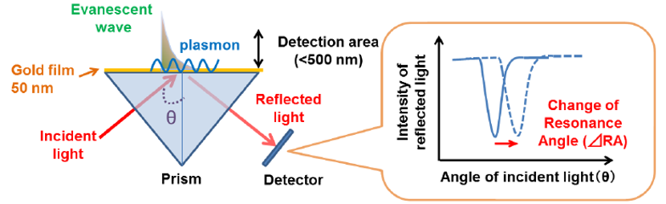

# SPR Detector Firmware

This firmare is used by the Surface Plasmon Resonance Detector. This detector could engineer the system so that the SPR phenomenon can occur and be observed. To obtain the SPR curve, this device is capable of varying the incident angle of the laser and capturing light intensity data as the incident angle changes, using the OV2640 camera module in conjunction with image processing methods.

Some features that it has are the following:
- Turning the laser on and off
- Moving the laser to a specific direction and angle
- Capturing images using OV2640 camera
- Performing pocedures to obtain the SPR curve

This device can be integrated with a graphical user interface ([GUI](https://github.com/kemalrizky/spr-detector-gui)) for device control and data visualization. It employs the HTTP protocol to establish communication with the GUI application.

---
### SPR Phenomena

### Instrumentation Block Diagram
.png)

### Electrical Schematic

### 3D Design

### Physical Prototype
.jpg)
.jpg)

### GUI and Acquired SPR Data

